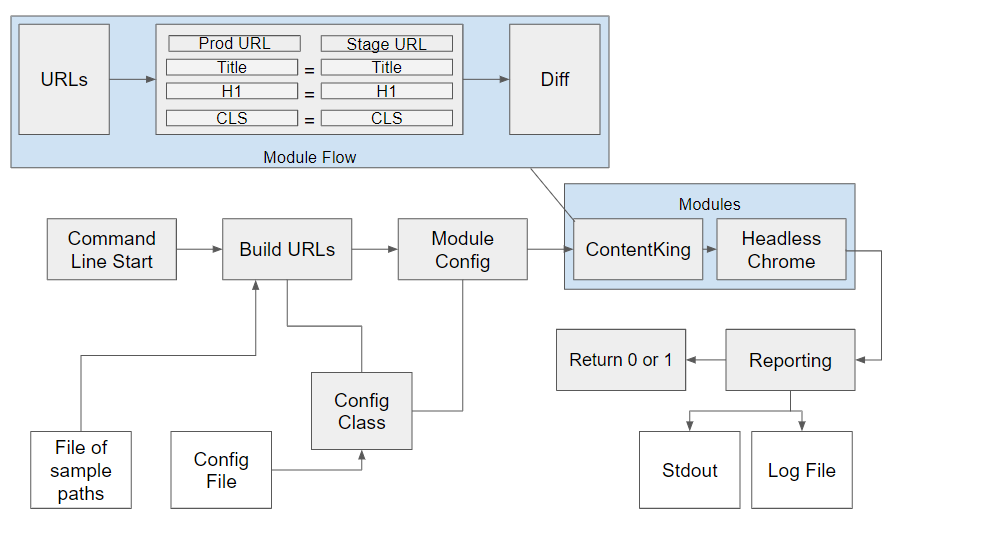

# SEODeploy: Flexible and Modular Python Library for Automating SEO Testing in Deployment Pipelines.

## Quick-start Guide
This library attempts to provide a flexible format to allow developers to incorporate SEO checks into development workflows.  It follows the following design constructs:

1. **Modular**: See the modules folder for examples of drop in testing using the `ModuleBase` class.  Modules dropped in here and configured in `seodeploy_config.yaml` are automatically tested against sample URLs.
2. **Diff Checking**: Developers can specify in the `seodeploy_config.yaml`file where they expect to see differences by ignoring checks.  Any other differences, depending on the design of the module, are diff checked across your prod and stage hosts and reported as errors.
3. **Sampled URLs**: The library supplies a sampling mechanism based on ContentKing URLs or a supplied XML sitemap URL that attempts to extract random samples in a statistically significant way.  But, developers are free to supply their own paths in the `path_samples.txt` file which are used to diff against production and staging.  One good route would be to supply a path representing each template type.
4. **Flexible**: The library contains code that is meant to be reconfigured and repurposed for individual needs.  We have tried to make classes and functions as flexible as possible, towards this end.
5. **Logging**: Error, Info, Warning notifications are logged to `seotesting.log` via included functionality.

See [TODO](todo.md) for what is currently in process.

Get started by downloading the repo at: [https://github.com/locomotive-agency/SEODeploy](https://github.com/locomotive-agency/SEODeploy)

!!! warning
    This library should be considered beta software and not used as a dependable
    solution without thorough testing.  Expect bugs.

## Modules Available
* [ContentKing](modules/contentking.md)
* [Headless](modules/headless.md)
* [Creating Your Own](modules/creating.md)

## Installing and Running
We use [Poetry](https://python-poetry.org/) for dependency management.  In the future, we will provide a PyPi repo where
the tool can be installed via standard `pip install seodeploy`

**Modules MUST be configured prior to running.  See Modules Available for configurations.**

### Install

    $ conda create --name seodeploy python=3.7 poetry

    $ conda activate seodeploy

    $ (seodeploy) git clone https://github.com/locomotive-agency/SEODeploy

    $ (seodeploy) cd SEODeploy

    $ (seodeploy) poetry install

    $ (seodeploy) poetry run seodeploy execute

### Configure Paths and Run

#### Create Samples Paths File

Using a ContentKing website (`1-12346` is the site ID):

    $ (seodeploy) seodeploy sample --siteid 1-12346

Using a XML sitemap or sitemap index file:

    $ (seodeploy) seodeploy sample \
                  --sitemap_url https://locomotive.agency/sitemap_index.xml

Using a XML sitemap or sitemap index file plus limiting:

    $ (seodeploy) seodeploy sample \
                  --sitemap_url https://locomotive.agency/sitemap_index.xml \
                  --limit 100

#### Compare Staging and Production

Uses `seodeploy_config.yaml` configuration and `sample_paths.txt`.

    $ (seodeploy) seodeploy execute

Use another sample paths file.

    $ (seodeploy) seodeploy execute --samples_filename another_file.txt

## Example Jenkins integration

### Jenkinsfile

    ...
    stage('Staging SEO Test') {
      steps {
          sh './jenkins/scripts/seo_test.sh'
      }
      post {
          success {
              echo 'Sending success SEO testing notification...'
              emailext body: "Job ${env.JOB_NAME} build ${env.BUILD_NUMBER} seo testing is complete.\n Check: ${env.BUILD_URL}",
                  recipientProviders: [[$class: 'DevelopersRecipientProvider'], [$class: 'RequesterRecipientProvider']],
                  subject: "Jenkins staging SEO test complete: Job ${env.JOB_NAME}"
          }
      }
    }
    ...

### seo_test.sh File

    python seodeploy sample --sitemap_url https://locomotive.agency/sitemap_index.xml
    python seodeploy execute
