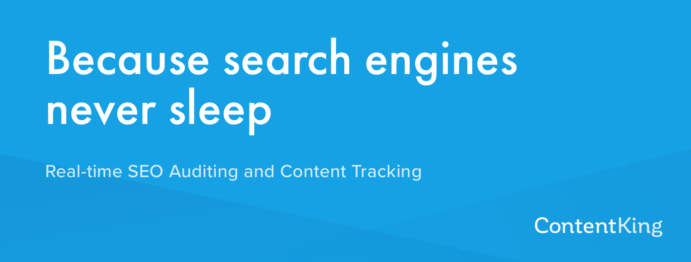

# SEODeploy: Guide for the ContentKing Module.

## About ContentKing

ContentKing keeps track of your website 24/7 so that you can catch unexpected SEO changes and issues before search engines and visitors do.



## Usage
To use the ContentKing Module, you need to have your production and staging websites active in the ContentKing App.

### Adding a Site
1. Go to your [Account page](https://app.contentkingapp.com/account/websites?view=list) and click Add Website.
2. Enter your domain and select the page capacity.
3. Click Add Website.
4. Set up Google Analytics and Google Search Console integrations for production, if desired. Click Save.
5. Set up alerts and reports for production, if desired.  Click Save.

### Configuring Sites
1. Go to your [Account page](https://app.contentkingapp.com/account/websites?view=list) and search for website.
2. If your staging site is behind Authentication, click on `Monitoring` and edit `Authentication` under `Advanced Settings`.
3. If your staging or production site requires cookies, click on `Monitoring` and edit `Cookies` under `Advanced Settings`.
4. Set up any path exclusions for your websites by clicking n the `Set up URL Exclusion List`.  It will ask if you want to import from your robots.txt file.
5. If you want to only check sample pages on staging, add `/` as a URL pattern exclusion.

Once configured, ContentKing will automatically monitor all added site pages, up to the number specified in page capacity or not excluded in URL exclusions.

### Getting your API Keys
You need to be on the Pro plan for ContentKing to activate the Reporting API.  The Reporting API is required for this tool to check status of URLs.

1. Go to [Account Settings](https://app.contentkingapp.com/account/settings/integration_tokens).
2. Copy your `CMS API` and `Reporting API` integration tokens. Create if needed.
3. Add the `CMS API` token to `modules_activated.contentking.cms_api_key` in `seotesting_config.yaml`.
4. Add the `Reporting API` token to `modules_activated.contentking.report_api_key` in `seotesting_config.yaml`.
5. Save your `seotesting_config.yaml` file.

### Configuring ContentKing Module
To activate the ContentKing Module, the following YAML code block should be nested under `modules_activated` in your `seotesting_config.yaml` file.

```
contentking:
  cms_api_key: XXXXXXXXXXXXXXXXXXXXXXXXXXXXXX
  report_api_key: XXXXXXXXXXXXXXXXXXXXXXXXXXXXXX

  endpoint: https://api.contentkingapp.com/v1/

  api_timeout: 20
  per_page: 300
  timezone: Europe/Amsterdam
  batch_size: 10
  batch_wait: 10
  time_col: unstable_last_checked_at

  prod_host: https://locomotive.agency
  prod_site_id: 5-5671785
  stage_host: https://stg.locomotive.agency/
  stage_site_id: 5-5671782

  replace_staging_host: True

  ignore:

    issues:
        analytics/analytics_missing: False
        analytics/visual_analytics_missing: False
        h1/duplicate: False
        h1/incorrect_length: False
        h1/missing: False
        h1/too_many: False
        canonical_link/incorrectly_canonicalized: False
        canonical_link/missing: False
        canonical_link/points_to_unindexable: False
        canonical_link/too_many: False
        images/alt_attribute: False
        images/title_attribute: False
        links/broken: False
        links/redirected: False
        links/to_canonicalized: False
        meta_description/duplicate: False
        meta_description/incorrect_length: False
        meta_description/missing: False
        meta_description/too_many: False
        title/duplicate: False
        title/incorrect_length: False
        title/missing: False
        title/too_many: False
        open_graph/description_incorrect_length: False
        open_graph/description_missing: False
        open_graph/image_missing: False
        open_graph/title_incorrect_length: False
        open_graph/title_missing: False
        open_graph/url_missing: False
        twitter_cards/description_incorrect_length: False
        twitter_cards/description_missing: False
        twitter_cards/image_missing: False
        twitter_cards/site_missing: False
        twitter_cards/title_incorrect_length: False
        twitter_cards/title_missing: False
        twitter_cards/type_invalid: False
        twitter_cards/type_missing: False
        xml_sitemap/incorrectly_missing: False
        xml_sitemap/incorrectly_present: False

    content:
        canonical: False
        title: False
        meta_description: False
        h1: False
        h2: False
        meta_robots: False
        open_graph_description: False
        open_graph_image: False
        open_graph_title: False
        open_graph_type: False
        open_graph_url: False
        twitter_card: False
        twitter_site: False
        google_analytics: False

    schema: False
```


#### Configurable Items

**API Settings:**

These are settings for configuring how the tool connects to ContentKing and which hosts it crawls.

* **cms_api_key**: (str) CMS API Key from ContentKing
* **report_api_key**: (str) Reporting API Key from ContentKing

* **api_timeout**: (int) Number of seconds to wait for ContentKing API to respond.
* **batch_size**: (int) Number of pages to check in each batch.
* **batch_wait**: (int) Number of seconds wait between each batch.

* **prod_host**: (str) URL of production host (eg. https://locomotive.agency)
* **prod_site_id**: (str) ContentKing ID for host (note: Get from website URL in ContentKing --> https://app.contentkingapp.com/account/websites/**7-453638**?view=list)
* **stage_host**: (str) URL of staging host (eg. https://stg.locomotive.agency)
* **stage_site_id**: (str) ContentKing ID for host (note: Get from website URL in ContentKing --> https://app.contentkingapp.com/account/websites/**4-17924878**?view=list)

* **replace_staging_host**: (bool) Whether to search/replace staging host with production host, in staging HTML.

**Comparison Settings**:

These are settings that affect what is compared between your production and staging URLs.

* **issues**: Issues are SEO Issues that ContentKing finds on each URL. Set `True` or `False`
* **content**: Content is extracted content, like H1s, H2s, and SEO Meta data for each URL.  Set `True` or `False`
* **schema**: Schema is extracted JSON+LD schema from each page. The tool recursively compares schema for changes.

### Running
Once configured, the ContentKing module will run against all sample paths on Staging and Production, comparing items not excluded in the `Comparison Settings` above.
